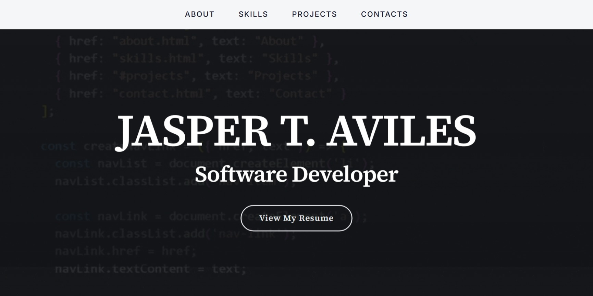
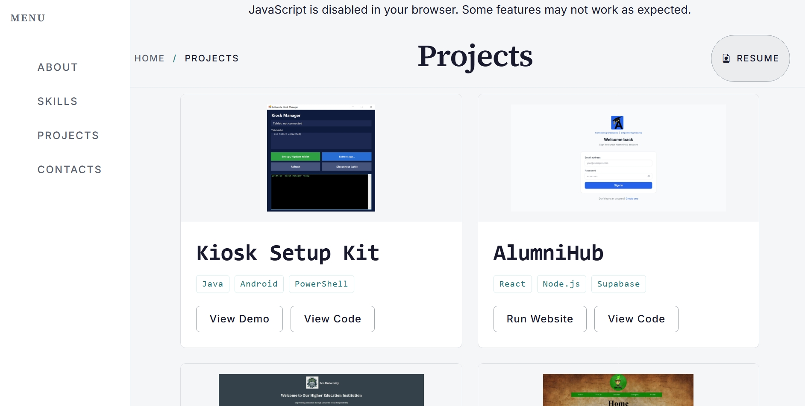

# Jasper T. Aviles — Portfolio (Noscript)

A CSS-only fallback version of the [main portfolio](https://github.com/jasperaviles54/portfolio) for users who have JavaScript disabled. This site provides the same content and visual experience using only HTML and CSS — no JavaScript logic is required to browse.

If JavaScript is available, visitors are automatically redirected to the [full portfolio](https://jasperaviles54.github.io/portfolio/).

🔗 **Live site:** [jasperaviles54.github.io/portfolio-noscript](https://jasperaviles54.github.io/portfolio-noscript/)

---

## Features

- 🎨 **CSS-only interactivity** — navigation toggle, hover effects, and layout powered entirely by CSS
- 🖼️ **GIF hero** — animated coding GIF replaces the video background (no JS needed for playback)
- ♿ **Accessible by design** — fully functional without JavaScript, with skip-to-content links and semantic HTML
- 🔄 **JS redirect** — a small inline `<script>` redirects JS-enabled visitors to the main portfolio
- 📄 **Print-friendly resume** — same resume page as the main version, optimized for printing
- 📱 **Responsive layout** — Bootstrap 5 grid ensures a good experience on all screen sizes

---

## Screenshots




---

## Tech Stack

| Layer | Technology |
|---|---|
| **Markup** | HTML5, semantic elements |
| **Styling** | Vanilla CSS, Bootstrap 5.3 (grid + utilities) |
| **Fonts** | Google Fonts (Inter, Source Serif 4) |
| **Hosting** | GitHub Pages |

> **Note:** This version intentionally has no JavaScript logic, no backend, and no database. The contact form displays contact information only — form submissions are handled by the [main portfolio](https://github.com/jasperaviles54/portfolio).

---

## How It Works

```
User visits portfolio-noscript/
  │
  ├── JS enabled?
  │     └── Yes → <script> redirects to portfolio/ (main site)
  │
  └── JS disabled?
        └── No redirect — user browses the CSS-only version
```

The noscript version mirrors the same page structure as the main portfolio but removes all JavaScript dependencies. Interactive elements like the mobile navigation toggle use the CSS checkbox hack (`<input type="checkbox">` + `:checked` selector) instead of JavaScript.

---

## Project Structure

```
├── index.html              # Hero landing page with GIF background
├── about.html              # About me + profile card
├── skills.html             # Skills grid + certifications
├── projects.html           # Project cards
├── contacts.html           # Contact information (no form submission)
├── resume.html             # Print-friendly resume page
├── 404.html                # Custom 404 page
├── styles.css              # Complete design system (CSS-only)
├── coding.gif              # Hero background animation
├── profile.png             # Profile photo
├── MyResume.pdf            # Downloadable resume
├── contact/icons/          # Social media SVG icons
├── projects/logos/         # Project thumbnails
├── skills/logos/           # Skill + certification images
└── docs/
    └── screenshots/        # README screenshots
```

---

## Differences from the Main Portfolio

| Feature | Main Portfolio | Noscript Version |
|---|---|---|
| **Hero background** | Autoplay video (`.mp4`) | Animated GIF |
| **Navigation toggle** | JavaScript event listener | CSS checkbox hack |
| **Theme toggle** | JavaScript + `localStorage` | Not available (dark theme only) |
| **Contact form** | Submits to Vercel API → Supabase | Static contact info display |
| **Java demos** | CheerpJ in-browser JVM | Not available |
| **Analytics** | Vercel Analytics | Vercel Analytics |

---

## Deployment

### GitHub Pages

This repo is deployed directly to GitHub Pages. Push to `main` and configure Pages to serve from the root.

No build step is required — the site is entirely static HTML and CSS.

---

## Related Repositories

| Repository | Description |
|---|---|
| [portfolio](https://github.com/jasperaviles54/portfolio) | Main portfolio (JS-enabled, full features) |
| **portfolio-noscript** (this repo) | CSS-only fallback for noscript users |

---

## License

This project is licensed under the MIT License — see the [LICENSE](LICENSE) file for details.

---

## Author

**Jasper T. Aviles** — Software Developer

- 🌐 [Portfolio](https://jasperaviles54.github.io/portfolio/)
- 💻 [GitHub](https://github.com/jasperaviles54)
